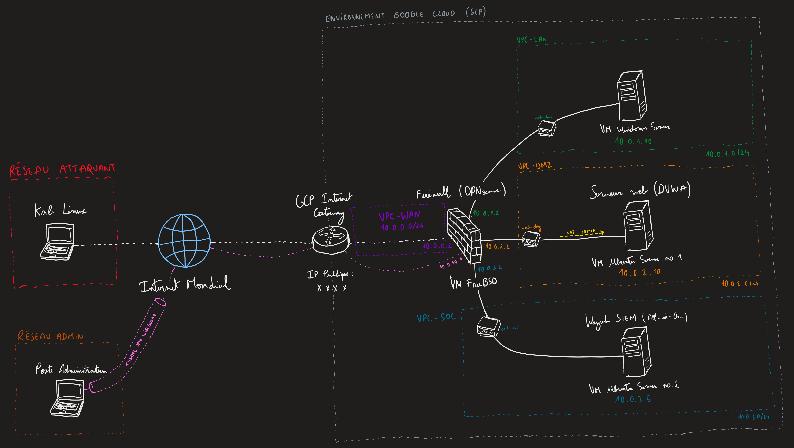
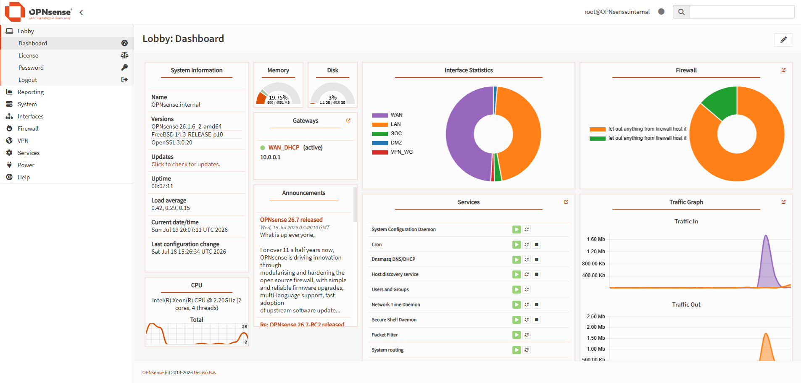
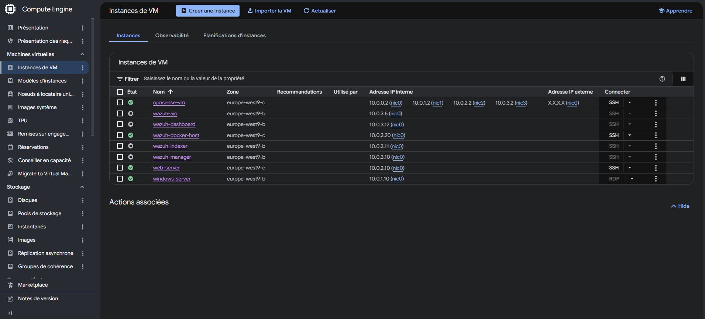
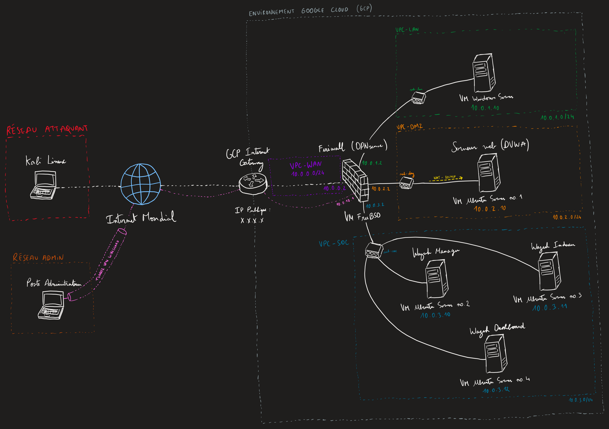
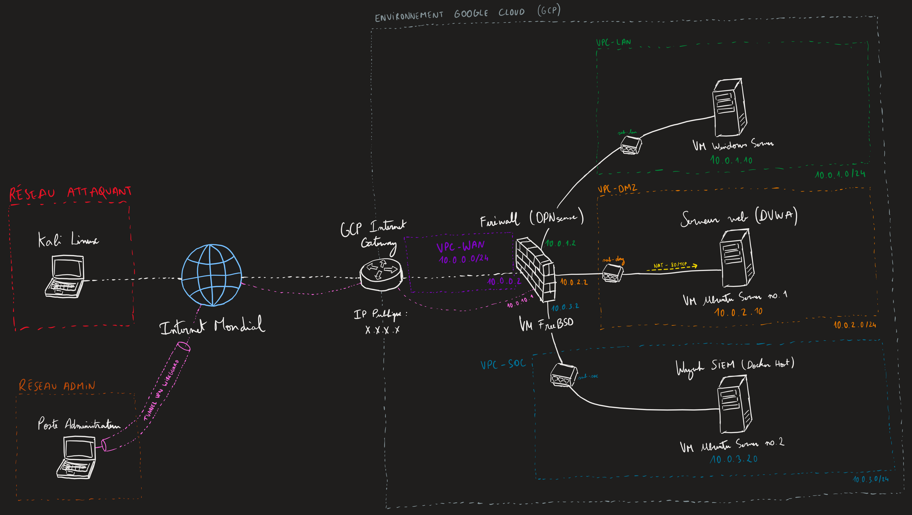
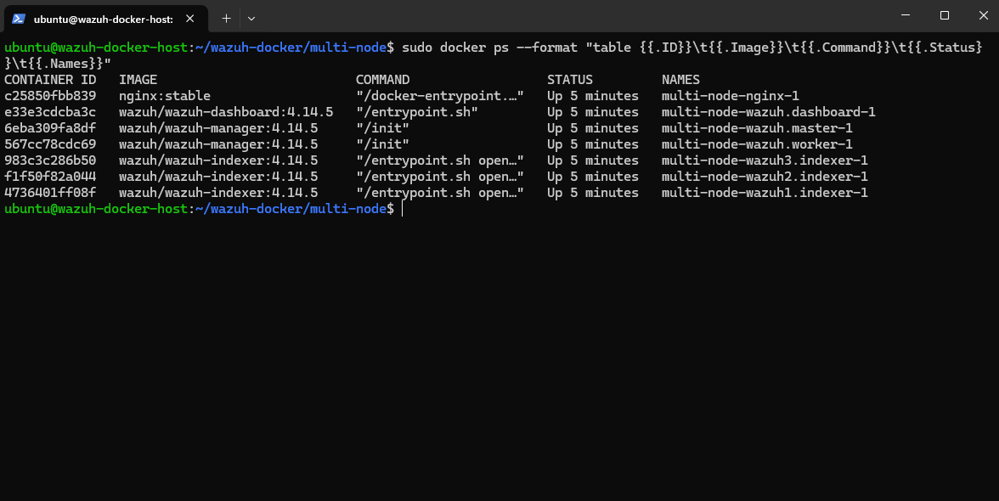

# Architecture et évolution de l'infrastructure

*Note : Le code de provisionnement (Infrastructure as Code) permettant de déployer les ressources cloud brutes est géré et documenté dans le dépôt Terraform dédié. Ce guide explicite la logique d'intégration, le routage et la configuration métier de l'infrastructure.*

---

## 1. Phase 1 : déploiement du socle (all-in-one et ingénierie réseau)

L'objectif de cette première phase est de construire l'ossature réseau étanche sur Google Cloud Platform et d'y déployer un prototype fonctionnel de la plateforme SIEM. La complexité de cette phase réside dans la superposition du routage virtuel de GCP et du routage interne de notre appliance pare-feu.



### 1.1 Cloisonnement réseau (VPC) et stratégie d'adressage
Pour simuler un environnement d'entreprise réaliste, l'architecture repose sur un VPC personnalisé (Virtual Private Cloud) découpé en quatre sous-réseaux isolés :
* **VPC-WAN (`10.0.0.0/24`) :** Zone d'exposition publique.
* **VPC-LAN (`10.0.1.0/24`) :** Zone de confiance (Poste Administrateur, Employés).
* **VPC-DMZ (`10.0.2.0/24`) :** Zone démilitarisée (Serveur Web DVWA).
* **VPC-SOC (`10.0.3.0/24`) :** Zone d'administration et de supervision (SIEM Wazuh).

**Règle de sécurité stricte :** Seule la passerelle OPNsense possède une adresse IP publique éphémère. Les serveurs cibles et le SIEM sont isolés sur des adresses privées et dépendent exclusivement du pare-feu pour communiquer entre eux ou avec l'extérieur. Les règles de pare-feu natives de GCP (VPC Firewall) ont été durcies pour n'autoriser que le trafic interne (`allow-internal`) et le port VPN.

### 1.2 Ingénierie de routage et configuration OPNsense
Le cœur névralgique du réseau est une instance FreeBSD faisant tourner OPNsense. Son intégration dans un environnement Cloud a nécessité une configuration réseau avancée pour supplanter les comportements par défaut de GCP :
* **Activation du transfert IP (IP forwarding) :** Ce paramètre vital a été activé directement sur l'hyperviseur Google Cloud pour l'instance OPNsense, l'autorisant ainsi à faire transiter des paquets dont elle n'est ni l'origine ni la destination finale.
* **Amorçage via port série (bootstrap) :** L'accès initial s'est fait sans interface réseau, en se connectant à la console série de GCP. Le filtre de paquets a été temporairement désactivé (`pfctl -d`) pour permettre l'accès à l'interface graphique d'administration et configurer les interfaces (WAN en DHCP, réseaux internes en adresses statiques).
* **Suppression du routage par défaut GCP :** Par défaut, Google Cloud crée des routes pointant vers sa propre passerelle Internet (priorité 1000) pour chaque sous-réseau. Plutôt que de créer des règles prioritaires, ces routes par défaut ont été purement et simplement supprimées. Ainsi, le trafic sortant des machines privées est naturellement contraint de traverser la seule passerelle restante : l'interface interne d'OPNsense.
* **Translation d'adresses (NAT) et pare-feu Cloud :** Mise en place d'un *Port Forwarding* (DNAT) sur l'interface WAN pour exposer le service Web DVWA. Pour que le serveur réponde correctement sans être bloqué par l'hyperviseur, la règle native GCP de la DMZ a été élargie (`source-ranges: 0.0.0.0/0`).

<br>


*Aperçu du tableau de bord OPNsense confirmant le bon provisionnement des interfaces (WAN, LAN, SOC, DMZ, VPN_WG) et la supervision du trafic inter-VPC.*

### 1.3 Accès sécurisé de l'administrateur (tunnel WireGuard et mRemoteNG)
Puisque les machines de travail sont invisibles depuis Internet, un canal d'administration "back-office" a été déployé pour permettre l'intervention de l'administrateur :
* **Tunnel VPN :** Déploiement d'un serveur WireGuard sur OPNsense avec ouverture du port UDP `51820` en entrée de zone WAN.
* **Administration distante :** Ce tunnel chiffré permet aux postes d'administration physiques de s'insérer virtuellement dans le réseau privé Cloud. C'est via ce lien que l'administrateur gère l'infrastructure à l'aide de mRemoteNG, centralisant les sessions RDP (vers Windows) et SSH (vers les serveurs Linux).

<details>
<summary>Cliquez ici pour voir la configuration WireGuard côté client (wg0.conf)</summary>

```ini
[Interface]
PrivateKey = <VOTRE_CLE_PRIVEE>
Address = 10.0.10.2/32

[Peer]
PublicKey = <CLE_PUBLIQUE_DU_SERVEUR>
AllowedIPs = 10.0.0.0/16
Endpoint = <IP_PUBLIQUE_DU_SERVEUR>:51820
PersistentKeepalive = 25
```
</details>

### 1.4 Dimensionnement des ressources et stratégie FinOps
Afin d'équilibrer les performances requises et l'optimisation des coûts, les instances Compute Engine ont été dimensionnées selon la grille suivante :

| Instance | Rôle métier | Type GCP | Profil matériel | Stockage (disque) |
|---|---|---|---|---|
| `opnsense-vm` | Routeur / pare-feu | `e2-highcpu-4` | 4 vCPUs / 4 Go RAM | 50 Go Balanced PD |
| `wazuh-aio` | SIEM monolithique | `e2-medium` | 2 vCPUs / 4 Go RAM | 100 Go Balanced PD |
| `web-server` | Serveur DVWA | `e2-small` | 2 vCPUs / 2 Go RAM | 20 Go Standard PD |
| `windows-server` | Poste LAN employé | `e2-medium` | 2 vCPUs / 4 Go RAM | 50 Go Balanced PD |

**Contrôle des coûts (FinOps) :**
S'agissant d'un environnement de laboratoire (PoC), la maîtrise de la facturation Cloud est primordiale. Une politique de ressource automatisée (`google_compute_resource_policy`) a été mise en place et attachée aux instances. Elle force l'arrêt des machines virtuelles tous les jours à minuit (fuseau horaire Europe/Paris), garantissant qu'aucune ressource inactive ne consomme de crédits pendant la nuit.


*Interface Google Cloud Platform illustrant le cloisonnement du réseau avec les adresses IP privées (10.0.X.X).*

### 1.5 Préparation des cibles (vecteurs d'attaque)
Déploiement des environnements isolés servant à générer les événements de sécurité :
* **Cible DMZ (Ubuntu Server) :** Hébergement de l'application intentionnellement vulnérable **DVWA** (Damn Vulnerable Web App). Déployée sur une stack **LAMP** (Apache2, PHP, MySQL) dans le répertoire standard `/var/www/html`, elle est accessible depuis Internet uniquement via les règles de NAT d'OPNsense. Cette machine sert de leurre interactif pour subir et journaliser des attaques externes (Injections SQL, Brute-force, RCE).
* **Cible LAN (Windows Server 2022) :** Simulation d'un poste de travail classique avec l'Expérience de Bureau. Isolé en interne, il permet de remonter des journaux d'événements de sécurité propres à l'écosystème Microsoft (logons échoués, élévation de privilèges).

### 1.6 Le nœud central (SIEM All-in-One)
Déploiement de la solution Wazuh dans sa configuration monolithique sur une instance Ubuntu `e2-medium` isolée dans le **VPC-SOC**. Le Manager, l'Indexer (Base de données) et le Dashboard cohabitent sur le même serveur. L'objectif est ici de valider l'ingestion : s'assurer que les agents déployés sur la cible Windows et la cible Ubuntu parviennent à traverser le pare-feu OPNsense pour s'authentifier et acheminer leurs alertes au SIEM.

### 1.7 Enrôlement des agents (log collection)
Une fois le SIEM et les cibles instanciés, la télémétrie a été activée via le déploiement d'agents Wazuh locaux sur les deux environnements :
* **Agent Linux (Cible DMZ) :** Installation via le gestionnaire de paquets (`apt`) et configuration du fichier `ossec.conf` pour pointer vers l'adresse IP privée du Manager.
* **Agent Windows (Cible LAN) :** Déploiement via le package d'installation standard (MSI) et exécution en tant que service système.

**Enjeu architectural :** L'objectif de cette étape était de valider la connectivité inter-VPC. Pour garantir le succès de l'enrôlement et l'acheminement des alertes (ports 1514/TCP et 1515/TCP), des règles de flux larges ont été appliquées sur OPNsense entre les zones LAN/DMZ et la zone SOC. Ce choix technique, bien que permissif, a permis d'écarter toute problématique de filtrage réseau lors de la phase de validation fonctionnelle de l'ingestion SIEM.

### 1.8 Limites de l'architecture et transition vers la phase 2
Bien que parfaitement fonctionnelle pour valider le routage réseau et l'ingestion initiale, l'architecture "All-in-One" présente un point de défaillance unique (SPOF) et des limites de ressources critiques. Le co-hébergement du moteur d'indexation (OpenSearch, très gourmand en RAM) et du moteur de corrélation (Wazuh Manager, exigeant en CPU) sur une seule et même machine crée rapidement un goulot d'étranglement lors d'attaques soutenues ou de déclenchements d'Active Response. 

Pour répondre aux standards de haute disponibilité, de résilience et de ségrégation des rôles exigés par un véritable SOC d'entreprise, le projet évolue naturellement vers la **Phase 2 : La scission du monolithe en une architecture distribuée**, où chaque composant (Manager, Indexer, Dashboard) sera isolé sur sa propre instance dédiée.

---

## 2. Phase 2 : architecture distribuée et ségrégation des rôles

Afin de pallier les limites du modèle monolithique (Point de Défaillance Unique - SPOF, goulets d'étranglement), l'infrastructure a été refondue vers une architecture distribuée multi-nœuds. 



### 2.1 Scission du cluster SIEM et redimensionnement (sizing "lite")
Le nœud "All-in-One" a été détruit et remplacé par trois instances dédiées au sein du **VPC-SOC**. S'agissant d'un environnement de validation (PoC), cette ségrégation a été pensée dans une logique d'optimisation des coûts (FinOps), en allouant les ressources Cloud au plus juste des prérequis de chaque composant :

| Instance | Rôle métier | Type GCP | Profil matériel | Stockage (disque) |
|---|---|---|---|---|
| `wazuh-indexer` | Base de données (OpenSearch) | `e2-medium` | 2 vCPUs / 4 Go RAM | 50 Go Balanced PD |
| `wazuh-manager` | Moteur de corrélation | `e2-medium` | 2 vCPUs / 4 Go RAM | 30 Go Balanced PD |
| `wazuh-dashboard` | Interface utilisateur (Web UI) | `e2-small` | 2 vCPUs / 2 Go RAM | 20 Go Standard PD |

*(Note : Ce dimensionnement très serré, notamment les 4 Go de RAM sur l'Indexer, a nécessité un réglage fin du noyau Linux pour éviter les crashs mémoire, détaillé dans le document 04_TROUBLESHOOTING.md).*

### 2.2 Déploiement de la PKI et sécurité des échanges (TLS)
Dans une architecture distribuée, les trois nœuds doivent obligatoirement communiquer entre eux via des canaux chiffrés pour prévenir toute interception de journaux sensibles sur le réseau interne.
* **Génération des certificats :** Utilisation de l'outil natif de Wazuh (`wazuh-certs-tool.sh`) sur le nœud initial pour générer une autorité de certification (CA) locale et les certificats TLS regroupés dans une archive d'installation.
* **Distribution sécurisée (Jump Host) :** L'infrastructure GCP interdisant l'authentification par mot de passe (clés SSH uniquement), le poste physique de l'administrateur a été utilisé comme "Machine de Rebond" au travers du tunnel WireGuard. L'archive a été rapatriée via `scp -i`, puis repoussée vers les autres nœuds avec cette même paire de clés d'administration.

### 2.3 Transition des agents et validation
Suite à la scission, les agents déployés lors de la Phase 1 (Serveur Web et Poste Windows) ont été reconfigurés (`ossec.conf`) pour pointer vers la nouvelle adresse IP privée du `wazuh-manager` dédié. L'infrastructure réseau est alors validée : les logs transitent correctement depuis les zones LAN/DMZ vers la zone SOC de manière chiffrée et distribuée. 
*(Note : La configuration avancée des agents et la logique de détection des attaques sont détaillées dans le document 03_DETECTION_AND_RESPONSE.md).*

### 2.4 Limites de l'architecture IaaS et transition vers la phase 3
Si la Phase 2 offre une résilience accrue grâce à la séparation des rôles, l'infrastructure reste lourde et difficile à maintenir à grande échelle :
* **Gaspillage de ressources (Overhead OS) :** Faire tourner trois noyaux Linux complets (OS) avec l'ensemble de leurs services de base uniquement pour héberger les trois briques du SIEM consomme inutilement du Compute Cloud.
* **Maintenance fastidieuse :** Maintenir des nœuds IaaS (Infrastructure as a Service) classiques freine la mise à l'échelle (ajout d'un nœud "Worker" pour absorber plus de charge) et complique les mises à jour.

Pour transformer cette infrastructure en une plateforme moderne, reproductible et légère, le projet évolue vers la **Phase 3 : La conteneurisation intégrale de la stack SIEM avec Docker Compose**.

---

## 3. Phase 3 : conteneurisation et haute disponibilité (Docker et NGINX)

Pour répondre aux défis de scalabilité et de maintenance identifiés en Phase 2, l'infrastructure du SIEM a subi une dernière refonte architecturale majeure : le passage d'un modèle IaaS (Machines Virtuelles dédiées) à un modèle CaaS (Containers as a Service).



### 3.1 Provisionnement de l'hôte Docker (Infrastructure as Code)
Les trois machines virtuelles de la Phase 2 ont été décommissionnées au profit d'un hôte central unique. Pour supporter la charge de multiples conteneurs (notamment les moteurs d'indexation basés sur Java), cette instance a été dimensionnée en conséquence :

| Instance | OS | Type GCP | Profil matériel | Stockage (disque) |
|---|---|---|---|---|
| `wazuh-docker-host` | Ubuntu 24.04 LTS | `e2-standard-4` | 4 vCPUs / 16 Go RAM | 100 Go Standard PD |

Cette méthode élimine la redondance des OS invités et permet de faire tourner l'ensemble de la stack logicielle dans des environnements isolés, légers et hautement reproductibles.

### 3.2 Topologie du cluster via Docker Compose
Le déploiement de la stack SIEM est désormais entièrement géré de manière déclarative par **Docker Compose** *(les fichiers de configuration sont disponibles dans le dossier `/docker` du dépôt)*. L'architecture conteneurisée déploie un véritable écosystème de production composé de 7 services interconnectés, pensés pour la ségrégation des rôles et la haute disponibilité :

* **Le Cluster d'indexation (OpenSearch) :** Déploiement de 3 nœuds distincts (`wazuh1.indexer`, `wazuh2.indexer`, `wazuh3.indexer`). Cette topologie à 3 nœuds respecte le principe du quorum, garantissant l'élection d'un nœud maître et la réplication des données (Shards) même en cas de défaillance de l'un des conteneurs.
* **Le Nœud Master (`wazuh.master`) :** Cerveau du SIEM (Control Plane). Il gère l'état du cluster, la synchronisation des règles de détection et expose l'API centrale.
* **Le Nœud Worker (`wazuh.worker`) :** Muscle du SIEM (Data Plane). Il est dédié à l'ingestion massive, l'analyse des logs et la corrélation. Il expose également le port UDP 5140 pour réceptionner les alertes Syslog du moteur Suricata.
* **L'interface (`wazuh.dashboard`) :** Exposée de manière sécurisée pour la visualisation des données et les investigations de l'équipe SOC.
* **Le Load Balancer (`nginx`) :** Front-end réseau de l'infrastructure Docker.

<br>


<br>
*Exécution de la commande `docker ps` (formatée) sur l'hôte Ubuntu, montrant l'instanciation réussie des 7 conteneurs.*

### 3.3 Équilibrage de charge (Load Balancer NGINX)
Avec l'introduction d'un cluster Master/Worker, les agents déployés sur les machines cibles (VPC-LAN et VPC-DMZ) ne peuvent plus pointer vers une adresse IP unique. Pour orchestrer ce flux, un proxy inverse **NGINX** a été placé en frontal de l'infrastructure Docker.

Agissant comme un proxy TCP (module `stream`), NGINX écoute sur le port **1514**. Il reçoit les connexions chiffrées des agents extérieurs et les distribue de manière transparente vers le cluster d'analyse, garantissant une ingestion fluide et supprimant tout goulet d'étranglement.

### 3.4 Bilan de l'infrastructure finale
À l'issue de cette Phase 3, le projet **CLOUDS** dispose d'une infrastructure réseau et Cloud robuste, cloisonnée (VPC/OPNsense) et d'un socle SIEM moderne, scalable et facilement reproductible. 

*L'infrastructure étant désormais stable, hautement disponible et performante, le focus opérationnel bascule sur l'ingénierie de détection (Blue Team) et la réponse aux incidents. L'ensemble des mécanismes de sécurité déployés sur cette stack (Règles XML, FIM, IDS Suricata, Active Response, intégration VirusTotal et Alerting Slack) est documenté de manière exhaustive dans le fichier **`03_DETECTION_AND_RESPONSE.md`**.*
